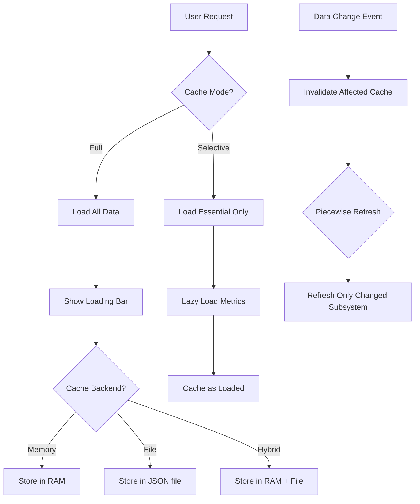

# Caching

System Implementation Plan

## Overview

This plan implements a flexible caching system that allows users to choose between full caching (fast subsequent loads, slower initial load) and selective loading (fast initial load, lazy-load expensive metrics). The system supports three storage backends (memory, file, hybrid) with piecewise refresh capabilities and per-page refresh strategies.

## Memory Usage Estimates

Based on typical data structures:

- **Dashboard metrics**: ~1-5KB (dict of dicts with floats)
- **Relief summary**: ~2-10KB (dict with aggregations)
- **Composite scores**: ~1-3KB (dict of floats)
- **Analytics page data**: ~10-50KB (includes chart data)
- **Total per user**: ~20-100KB (depends on dataset size)
- **For 100 concurrent users**: ~2-10MB (reasonable for most servers)

Server memory caching is viable for most deployments. File caching provides persistence across restarts but slower access.

## Current Caching State

- Analytics class uses class-level in-memory cache (`_relief_summary_cache`, `_composite_scores_cache`)
- Cache TTL: 5 minutes (300 seconds) for relief/composite scores
- No persistent storage
- No loading UI/progress indication
- No user-configurable cache modes

## Architecture




## Implementation Components

### 1. Cache Manager (`backend/cache_manager.py`)

New centralized cache management system with three backends:**Cache Backend Types:**

- `memory`: Python dict in RAM (fastest, lost on restart)
- `file`: JSON files in `data/cache/` (persists, slower)
- `hybrid`: Memory + file backup (fast + persistent)

**Features:**

- Piecewise cache keys per subsystem (e.g., `analytics.relief_summary`, `dashboard.metrics`)
- TTL support per cache entry
- Invalidation by prefix/pattern
- Serialization helpers for complex objects
- Thread-safe operations

**API:**

```python
class CacheManager:
    def get(self, key: str, subsystem: str) -> Optional[Any]
    def set(self, key: str, value: Any, subsystem: str, ttl: Optional[int] = None)
    def invalidate(self, pattern: str, subsystem: Optional[str] = None)
    def clear_subsystem(self, subsystem: str)
    def get_cache_stats(self) -> Dict[str, Any]
```


### 2. Loading UI Component (`ui/loading_screen.py`)

Modal overlay with progress bar for full caching mode:**Features:**

- Progress bar showing cache loading progress
- Estimated time remaining
- Cancellable (falls back to selective loading)
- Shows current operation (e.g., "Loading analytics data...")
- 60-second timeout with graceful degradation

**Usage:**

```python
with loading_screen("Loading dashboard data...", timeout=60):
    # Load all cached data
    ...
```


### 3. Cache Mode Selection UI

**Location:** Settings page (`ui/settings_page.py`) under "Experimental" section**Options:**

- `full`: Load all data upfront with caching (slow initial, fast subsequent)
- `selective`: Fast initial load, lazy-load metrics (fast initial, slower on-demand)
- `disabled`: No caching, always fresh (slowest, always accurate)

**Storage:** User preference in `user_preferences.csv` (column: `cache_mode`)**Cache Backend Selection:**

- `memory`: Server memory only (default for full mode)
- `file`: File-based only (default for selective mode)
- `hybrid`: Memory + file backup (recommended, **default**)

### 4. Refresh Strategy Implementation

**Per-Page Refresh Rules:**

1. **Dashboard** (`ui/dashboard.py`):

- Monitored metrics cards: **Always refresh** after task completion (regardless of cache)
- Analytics summary: Cache with invalidation on task completion
- Task lists: Cache with TTL, refresh on task operations

2. **Analytics Page** (`ui/analytics_page.py`):

- **Full mode**: Pre-load everything on first app load (if caching selected)
- **Selective mode**: Load on page visit, cache for session
- Manual refresh button always available
- Auto-refresh when new task completed

3. **Summary Page** (`ui/summary_page.py`):

- **Full mode**: Cache once per day (on first page load of day)
- **Selective mode**: Load on every page visit
- Invalidate daily at midnight

4. **Other Pages**:

- Experimental/goals/settings/glossary: No caching (as specified)

### 5. Cache Invalidation Triggers

**Event-Based Invalidation:**

1. **Task Completion** (`backend/instance_manager.py`):
2. Invalidate: `dashboard.metrics`, `analytics.*`

- Keep: `summary.*` (daily refresh only)

2. **Task Creation/Update** (`backend/task_manager.py`):

- Invalidate: `dashboard.tasks`, `analytics.recommendations`

3. **Daily Reset** (via scheduler):

- Invalidate: `summary.*` (force daily refresh)

4. **Manual Refresh**:

- User-triggered refresh buttons invalidate specific subsystems

### 6. Analytics Integration (`backend/analytics.py`)

Update Analytics class to use CacheManager:**Changes:**

- Replace class-level cache variables with CacheManager
- Add cache key prefix: `analytics.*`
- Support selective loading per method
- Maintain backward compatibility (graceful fallback if cache disabled)

**Method Updates:**

- `get_relief_summary()`: Use `analytics.relief_summary` cache key
- `get_dashboard_metrics()`: Use `analytics.dashboard_metrics` cache key
- `get_all_scores_for_composite()`: Use `analytics.composite_scores` cache key

### 7. App Initialization Flow (`app.py`)

**First Load Decision Point:**Before dashboard loads, check:

1. User's cache mode preference
2. If `full` mode: Show loading screen, pre-load all cachable data
3. If `selective` mode: Load dashboard immediately, lazy-load metrics

**Flow:**

```python
@ui.page('/')
def index():
    cache_mode = user_state.get_cache_mode(user_id)
    if cache_mode == 'full' and is_first_load():
        # Show loading screen
        with loading_screen("Preparing your dashboard..."):
            preload_all_cacheable_data()
    # Build dashboard (uses cached data if available)
    build_dashboard(task_manager)
```


## Files to Create/Modify

### New Files:

1. `backend/cache_manager.py` - Cache management system
2. `ui/loading_screen.py` - Loading UI component
3. `data/cache/` - Cache file storage directory (created automatically)

### Modified Files:

1. `backend/analytics.py` - Integrate CacheManager
2. `backend/user_state.py` - Add cache mode preference methods
3. `ui/dashboard.py` - Use caching, always refresh metrics after completion
4. `ui/analytics_page.py` - Implement caching with refresh strategies
5. `ui/summary_page.py` - Daily cache refresh logic
6. `ui/settings_page.py` - Add cache mode selection UI
7. `app.py` - First-load decision point
8. `backend/instance_manager.py` - Add cache invalidation on completion
9. `backend/task_manager.py` - Add cache invalidation on task changes

## Testing Strategy

1. **Memory Usage**: Monitor cache size with various dataset sizes
2. **Performance**: Compare load times across cache modes
3. **Persistence**: Test file cache survives server restart
4. **Invalidation**: Verify cache refreshes correctly on events
5. **Edge Cases**: Empty cache, corrupted cache files, concurrent access

## Migration Path

1. **Phase 1**: Create CacheManager, maintain existing Analytics cache (backward compatible)
2. **Phase 2**: Add loading UI and cache mode selection (default: selective)
3. **Phase 3**: Integrate CacheManager into Analytics and pages
4. **Phase 4**: Add invalidation triggers
5. **Phase 5**: Test and optimize cache TTL values

## Risks & Mitigation

1. **Memory bloat**: Monitor cache size, implement LRU eviction if needed
2. **Stale data**: Clear invalidation rules, always refresh critical metrics
3. **File I/O bottlenecks**: Use async file operations, batch writes
4. **Cache corruption**: Validate JSON on load, fallback to recalculation
5. **Concurrent access**: Use thread-safe operations, lock files for file backend

## Future Enhancements

- LRU eviction for memory cache
- Cache compression for large datasets
- Redis backend option (for multi-server deployments)
- Cache analytics (hit rates, performance metrics)
- Tiered access (free users: file, paid: memory)

## Configuration

**Environment Variables:**

- `CACHE_MODE`: Default cache mode (`full`, `selective`, `disabled`)
- `CACHE_BACKEND`: Default backend (`memory`, `file`, `hybrid`) - **default: `hybrid`**
- `CACHE_DIR`: Cache file directory (default: `data/cache/`)
- `CACHE_MAX_SIZE_MB`: Maximum cache size in MB (default: 100)

**User Preferences:**