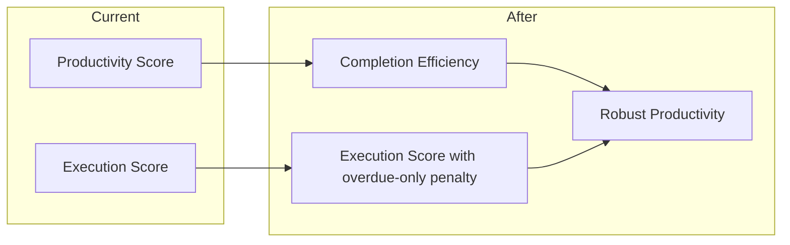

# Completion Efficiency Score and Robust Productivity Plan

**Scope:** Productivity score refactor only. Execution Quality and Utility/Challenge scores are out of scope (to be implemented in separate agent runs).

---

## 1. Naming and Data Model

| Current                                                               | After                                                              |
| --------------------------------------------------------------------- | ------------------------------------------------------------------ |
| "Productivity score" (label)                                          | **"Completion Efficiency score"**                                  |
| Same formula (completion_pct × task_type × efficiency × goal/burnout) | Unchanged; only display name and internal naming where user-facing |
| N/A                                                                   | **New metric:** "Robust Productivity" (separate, added to metrics) |

- **Task type:** Unchanged. Work / self-care / play multipliers and play penalty stay as in [analytics.py](task_aversion_app/backend/analytics.py) `get_task_type_multiplier` and `calculate_productivity_score`.
- **Difficulty:** Use existing **task_difficulty** (and stress/mental_energy where already used). It is already a component of stress (branched from cognitive_load → difficulty + mental_energy). No new "expected difficulty" field.

---

## 2. Overdue-Only Start Penalty (for Execution Score)

Execution score will be a component of Robust Productivity. So this plan includes the minimal execution-score change needed for that:

- **Delay definition:** Overdue start penalty = delay from **due_at** to **started_at** (how late the user started after the deadline). Only when the instance is overdue (completed after due_at, or started after due_at—align with [urgency.py](task_aversion_app/backend/urgency.py) `overdue`).
- **Placement:** The **overdue-only penalty** lives **in the execution score**. Replace or make conditional the current "start_speed" term in [analytics.py](task_aversion_app/backend/analytics.py) `calculate_execution_score` (around 7928–7968): when the task has no due date or is not overdue, **no bonus and no penalty** from start timing. When overdue, apply a penalty based on (due_at → started_at) delay.
- **No due date:** Zero impact on execution score (no bonus, no penalty).

After this, execution score = difficulty + speed + completion + (overdue-only start penalty when applicable). That execution score is then used as a component of Robust Productivity.

---

## 3. Completion Efficiency Score (Rename Only)

- **Rename everywhere** the current productivity score to **"Completion Efficiency score"**:
  - **Backend:** Function name `calculate_productivity_score` → `calculate_completion_efficiency_score` (or keep and add an alias for clarity); docstrings and comments; constant `PRODUCTIVITY_SCORE_VERSION` → `COMPLETION_EFFICIENCY_SCORE_VERSION`; any internal keys that are user-facing (see below).
  - **API/relief summary:** Decide key naming (see open question 1). Options: keep `weekly_productivity_score` key but document/semantic as "completion efficiency", or rename to `weekly_completion_efficiency_score` and reserve `weekly_productivity_score` for robust.
  - **Dashboard/UI:** All labels "Productivity Score" → "Completion Efficiency score" (e.g. [dashboard.py](task_aversion_app/ui/dashboard.py) metric labels, tooltips, `selected_metrics` options, history keys like `productivity_scores` → `completion_efficiency_scores` if we rename keys).
  - **Docs:** [docs/productivity_score_v1.1.md](task_aversion_app/docs/productivity_score_v1.1.md) and [PRODUCTIVITY_SCORE_SYNOPSIS.md](PRODUCTIVITY_SCORE_SYNOPSIS.md) — rename to completion efficiency and update references.
- **Idle-refresh variant:** "Daily Productivity Score (idle refresh)" → "Daily Completion Efficiency score (idle refresh)" (label and any `daily_productivity_score_idle_refresh` key if we rename; otherwise only label).
- **CSV/export:** If any column or config key says "productivity_score" in a user-visible way, align with chosen key strategy (rename or keep key and only change labels).

Files to touch for rename (non-exhaustive): [analytics.py](task_aversion_app/backend/analytics.py), [dashboard.py](task_aversion_app/ui/dashboard.py), [analytics_glossary.py](task_aversion_app/ui/analytics_glossary.py), [plotly_data_charts.py](task_aversion_app/ui/plotly_data_charts.py), [csv_export.py](task_aversion_app/backend/csv_export.py), [user_state.py](task_aversion_app/backend/user_state.py), [productivity_module.py](task_aversion_app/ui/productivity_module.py), [productivity_settings_page.py](task_aversion_app/ui/productivity_settings_page.py), [productivity_grit_tradeoff.py](task_aversion_app/ui/productivity_grit_tradeoff.py), [formula_control_system.py](task_aversion_app/ui/formula_control_system.py), [formula_baseline_charts.py](task_aversion_app/ui/formula_baseline_charts.py), plus docs and scripts under `scripts/graphic_aids/` that reference productivity score.

---

## 4. Robust Productivity Score (New Metric)

- **Definition:** A new metric that combines:
  - **Completion Efficiency score** (the renamed current formula).
  - **Execution score** (including the new overdue-only start penalty as above).
  - Optional: volume/consistency or other factors (can be added later with same pattern).
- **Weights:** Use configurable or fixed weights (e.g. 0.5 completion efficiency + 0.5 execution, or 0.6/0.4). To be set in code or via productivity settings; document default.
- **Scale:** Define explicit scale (e.g. 0–100) and how to aggregate (e.g. weekly sum or average of per-task robust score).
- **Placement:** Add to metrics system and dashboard as a **separate** selectable metric (e.g. "Robust Productivity"); do not replace the renamed Completion Efficiency metric. Both appear in metric selector and anywhere else relevant (e.g. relief summary, composite).
- **Backend:** New function(s), e.g. `calculate_robust_productivity_score` (per task or per period) and `get_weekly_robust_productivity` (or equivalent), plus relief summary / dashboard payload keys (e.g. `weekly_robust_productivity_score`).

---

## 5. Implementation Order (for agent splits)

1. **Overdue-only penalty in execution score**
  In [analytics.py](task_aversion_app/backend/analytics.py): change `calculate_execution_score` to use delay from **due_at** to **started_at** only when overdue; no start term when no due date or not overdue. Keep execution score formula otherwise (difficulty + speed + completion).
2. **Rename: Productivity → Completion Efficiency**
  Rename all user-facing labels and, per decision on keys, internal keys and function names. Update dashboard, glossary, exports, docs, and scripts. Ensure existing "productivity" config (e.g. `productivity_settings`, `productivity_goal_settings`) is either kept for backward compatibility or migrated with a clear strategy.
3. **Add Robust Productivity metric**
  Implement `calculate_robust_productivity_score` (and any batch/period helpers), wire into relief summary and dashboard metrics, add to metric selector and any composite that should include it. Use existing task_difficulty (and execution score) as components; no new difficulty field.

---

## 6. Open Questions

1. **Key naming for rename:** Should we rename internal keys (e.g. `weekly_productivity_score` → `weekly_completion_efficiency_score`, `productivity_scores` → `completion_efficiency_scores`) and reserve `weekly_productivity_score` for the new robust metric, or keep existing keys and only change UI labels (so "productivity_score" in API still means completion efficiency)?
2. **Robust productivity formula:** Confirm weights (e.g. 50/50 completion efficiency vs execution) and aggregation (e.g. weekly average of per-task robust scores vs sum). Should this be configurable in productivity settings from day one?
3. **Composite score:** Should the dashboard/composite that currently uses "productivity score" switch to Robust Productivity, or keep using Completion Efficiency and show Robust Productivity as an additional metric only?

---

## 7. Out of Scope (for later plans)

- Execution **quality** score and sub-scores / glossary charts.
- **Utility** score (expected/actual relief, etc.).
- **Challenge** score (combination of productivity + execution/difficulty) — to be implemented when returning to execution quality and utility/challenge.

---

## 8. Diagram (High Level)

- **Completion Efficiency** = current productivity formula (renamed).
- **Execution score** = difficulty + speed + completion + (overdue-only penalty from due_at to started_at).
- **Robust Productivity** = new metric combining Completion Efficiency + Execution score (and optionally more later).

