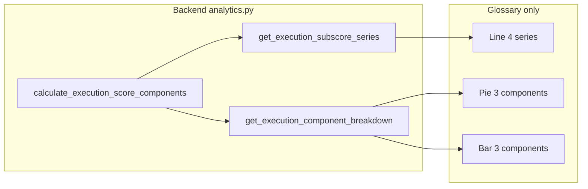

# Execution Score Refinement and Implementation Plan

Scope: **Execution score only**. Charts appear **only in the Analytics Glossary** execution module tab (no Dashboard or main Analytics page changes).

---

## 1. Sub-scores: four components (separate start and completion)

**Backend ([task_aversion_app/backend/analytics.py](task_aversion_app/backend/analytics.py))**

- **Expose four factors** without changing the combined formula. Add a new method that returns per-instance components plus combined score, reusing the same logic as `calculate_execution_score` (lines 7889–8010):
  - `difficulty` (0–1 or 0–100)
  - `speed` (0–1 or 0–100)
  - `start` (0–1 or 0–100)
  - `completion` (0–1 or 0–100)
  - `execution_score` (combined, 0–100)
  Option: add `calculate_execution_score_components(row, task_completion_counts)` returning a dict with these five keys. Implement by extracting the four factor computations from `calculate_execution_score` into internal helpers (or inlining the same logic in the new method) so the combined formula stays identical.
- **Time-series for line chart**: Add `get_execution_subscore_series(days=30, user_id=None)` returning e.g.:
  - `dates`: list of date strings
  - `difficulty`, `speed`, `start`, `completion`: lists of daily averages (one value per date)
  - optionally `execution_score`: list of daily combined score
  Reuse the same loading/filtering as `get_execution_score_history` (around 9867–9950), but for each instance call the new components method and aggregate by date.
- **Component breakdown for pie/bar (3 components)**: Add `get_execution_component_breakdown(days=30, user_id=None)` returning aggregates for **three** components:
  - **Difficulty** (same as sub-score difficulty)
  - **Speed** (same as sub-score speed)
  - **Start & completion** (single aggregate: e.g. average of `(start_factor + completion_factor) / 2` per task, or average of `start * completion`; define one and document). Return structure suited for pie (e.g. three values that sum to 100 for share) and for bar (e.g. 7-day rolling averages for the same three components).
  So: 4 sub-scores everywhere in backend and for the **line** chart; **3** components only for **pie** and **bar** (start and completion combined into one).

---

## 2. Glossary overview: three charts (line, pie, bar)

**Chart semantics**

- **Line**: 4 series — Difficulty, Speed, Start, Completion over time (e.g. last 30 days). Uses `get_execution_subscore_series`.
- **Pie**: 3 components — Difficulty, Speed, Start & completion (share of total or relative contribution). Uses `get_execution_component_breakdown`.
- **Bar**: 3 components — 7-day averages for Difficulty, Speed, Start & completion. Uses same breakdown (or a variant that returns 7d averages).

**UI ([task_aversion_app/ui/analytics_glossary.py](task_aversion_app/ui/analytics_glossary.py), [task_aversion_app/ui/plotly_data_charts.py](task_aversion_app/ui/plotly_data_charts.py))**

- **Glossary**: Support multiple overview charts for execution only.
  - Add an `overview_charts` key (list) for the execution module, e.g. `overview_charts: ['execution_line', 'execution_pie', 'execution_bar']`.
  - In the module-detail render path (around 414–439), if `overview_charts` is present, iterate and render each chart (each key in `PLOTLY_DATA_CHARTS`); if only `overview_chart` (singular) is present, keep current behavior for backward compatibility (thoroughness).
  - Ensure execution overview section is only rendered on the **Execution Score** glossary tab (no change to Analytics page or Dashboard).
- **Plotly generators** (in `plotly_data_charts.py`):
  - `generate_execution_overview_line_plotly(user_id=None)`: line chart, 4 series from `get_execution_subscore_series`. Handle empty data (no chart or message).
  - `generate_execution_overview_pie_plotly(user_id=None)`: pie with 3 labels: Difficulty, Speed, Start & completion; values from `get_execution_component_breakdown`.
  - `generate_execution_overview_bar_plotly(user_id=None)`: bar chart with 3 bars (7-day averages) from breakdown.
- **Registry**: Add to `PLOTLY_DATA_CHARTS`: `execution_line`, `execution_pie`, `execution_bar`.

---

## 3. Data flow summary

---

## 4. Implementation order

1. **Backend**: Add `calculate_execution_score_components` and factor extraction (or shared helpers) so the combined execution score is unchanged.
2. **Backend**: Add `get_execution_subscore_series` and `get_execution_component_breakdown` (3-component aggregation for pie/bar).
3. **Plotly**: Implement the three chart generators and register them in `PLOTLY_DATA_CHARTS`.
4. **Glossary**: Add `overview_charts` for execution and render the three charts only on the Execution Score module tab.

---

## 5. Out of scope (per your constraints)

- Start delay / due-date logic: already implemented (overdue-only penalty in `calculate_execution_score`); no change.
- Dashboard or main Analytics page: no new execution charts there.
- Task Quality, Utility, Challenge, or Productivity refactors: not part of this plan.

---

## 6. Files to touch

| File                                                                                     | Changes                                                                                                                                                              |
| ---------------------------------------------------------------------------------------- | -------------------------------------------------------------------------------------------------------------------------------------------------------------------- |
| [task_aversion_app/backend/analytics.py](task_aversion_app/backend/analytics.py)         | Add `calculate_execution_score_components`, `get_execution_subscore_series`, `get_execution_component_breakdown`.                                                    |
| [task_aversion_app/ui/plotly_data_charts.py](task_aversion_app/ui/plotly_data_charts.py) | Add `generate_execution_overview_line_plotly`, `generate_execution_overview_pie_plotly`, `generate_execution_overview_bar_plotly`; register in `PLOTLY_DATA_CHARTS`. |
| [task_aversion_app/ui/analytics_glossary.py](task_aversion_app/ui/analytics_glossary.py) | Add `overview_charts` for `execution_score`; extend module-detail view to render multiple overview charts when `overview_charts` is present.                         |

