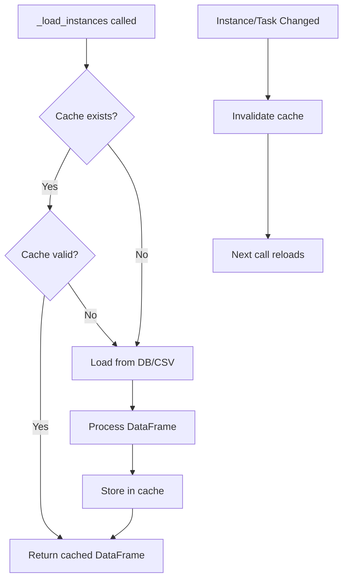

# Optimize _load_instances() Performance Plan

## Problem Statement

The `_load_instances()` method in `backend/analytics.py` is called **59 times** throughout the codebase. Each call:

1. **Reads from database/CSV** (~50-200ms for DB, ~100-500ms for CSV depending on size)
2. **Converts to DataFrame** (~10-50ms)
3. **Parses JSON fields** for all rows (~100-300ms for large datasets)
4. **Fills/processes ~20+ columns** with multiple `apply()` operations (~200-500ms)
5. **Applies gap filtering** (~50-100ms)
6. **Calculates derived columns** (stress_level, net_wellbeing, etc.) (~100-200ms)

**Total per call: ~500-1400ms** for typical datasets (100-1000 instances)

With 59 calls, this could mean **30-80 seconds** of redundant processing even though most methods don't need fresh data.

## Current State

- No caching of loaded/processed DataFrame
- Each method call triggers full reload and reprocessing
- Existing cache only stores calculation results (relief_summary, composite_scores), not the source data
- Gap filtering always applied even when not needed

## Solution Architecture



## Implementation Details

### 1. Instance-Level Cache

Add class-level cache similar to existing `_relief_summary_cache`:

```python
class Analytics:
    _instances_cache = None
    _instances_cache_time = None
    _instances_cache_params = None  # Track completed_only param
    _instances_cache_ttl = 300  # 5 minutes default
```

**Cache Key Factors:**
- `completed_only` parameter (different queries)
- Data source (CSV vs DB)
- Timestamp of last data change

### 2. Smart Cache Invalidation

**Invalidation Triggers:**
- Task instance created/updated/completed → Invalidate
- Task definition changed → Invalidate
- Gap preference changed → Invalidate (affects gap filtering)

**Integration Points:**
- `backend/instance_manager.py`: Invalidate on create/update/complete
- `backend/task_manager.py`: Invalidate on task changes
- `backend/user_state.py`: Invalidate on gap preference change

### 3. Optimize JSON Parsing

**Current:** Row-by-row `apply()` operations
```python
df['predicted_dict'] = df['predicted'].apply(_safe_json)
```

**Optimized:** Vectorized where possible, batch parsing
```python
# Cache parsed JSONs
# Use pd.Series.map() instead of apply() for simple operations
```

### 4. Lazy Column Processing

Many derived columns (stress_level, net_wellbeing, etc.) are calculated even when not needed. Make them lazy:

```python
def _ensure_calculated_columns(self, df: pd.DataFrame, columns: List[str]):
    """Calculate derived columns only if needed."""
    if 'stress_level' in columns and 'stress_level' not in df.columns:
        # Calculate stress_level
    # etc.
```

### 5. Optional Gap Filtering

Make gap filtering optional:
```python
def _load_instances(self, completed_only: bool = False, apply_gap_filter: bool = True):
    # Skip gap filtering if not needed
```

## Files to Modify

1. **`backend/analytics.py`**:
   - Add cache variables
   - Modify `_load_instances()` to check/update cache
   - Add `_invalidate_instances_cache()` method
   - Optimize JSON parsing and column processing

2. **`backend/instance_manager.py`**:
   - Call cache invalidation on instance changes
   - Integrate with CacheManager when available

3. **`backend/task_manager.py`**:
   - Call cache invalidation on task changes

## Performance Targets

**Before:**
- Each `_load_instances()` call: 500-1400ms
- 59 calls during analytics page load: 30-80 seconds

**After:**
- First `_load_instances()` call: 500-1400ms (cache miss)
- Subsequent calls: <10ms (cache hit)
- 59 calls with cache: ~600ms (first) + 58 * 5ms = ~890ms
- **Expected speedup: 30-90x faster** for cached scenarios

## Testing Strategy

1. **Benchmark current performance**: Time 59 sequential calls
2. **Test cache hits**: Verify subsequent calls are fast
3. **Test cache invalidation**: Verify cache clears on data changes
4. **Test edge cases**: Empty data, large datasets, corrupted data
5. **Verify correctness**: Ensure cached data matches fresh data

## Risks & Mitigation

1. **Memory usage**: Cached DataFrame could be large (10-50MB for 1000 instances)
   - Mitigation: Implement LRU eviction, set size limits
2. **Stale data**: Cache might not invalidate correctly
   - Mitigation: Comprehensive invalidation triggers, TTL fallback
3. **Cache corruption**: Exception during caching could leave bad data
   - Mitigation: Try/except blocks, cache validation on load

## Time Estimate

**Total: 8-11 hours**

Breakdown:
- Add instance-level cache: **2-3 hours**
  - Cache variables, cache check logic, basic TTL
- Implement cache invalidation: **1-2 hours**
  - Invalidation triggers in instance_manager/task_manager
- Optimize JSON parsing: **2-3 hours**
  - Vectorize operations, reduce apply() overhead
- Lazy column processing: **2-3 hours**
  - Refactor to calculate only needed columns
- Testing and debugging: **2-3 hours**
  - Benchmarks, edge cases, correctness verification

**Priority: High** - This optimization will dramatically improve analytics page load times and overall app responsiveness.

## Dependencies

- Can be implemented independently of CacheManager (uses simple class-level cache initially)
- Will integrate with CacheManager later for better cache management
- No external dependencies needed

## Future Enhancements

- Integrate with CacheManager for persistent caching
- Implement column-level caching (cache individual calculated columns)
- Add cache warming strategies (pre-load on app start if full cache mode)
- Cache metadata (row counts, date ranges) for quick checks

