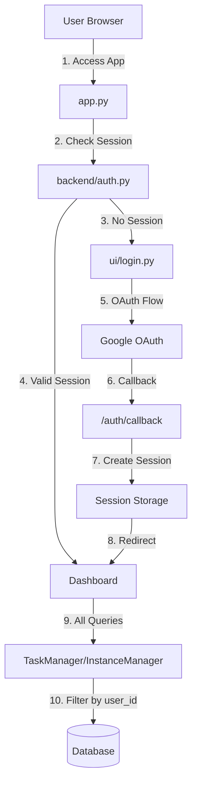

# Phase 2B OAuth Migration Plan

## Current State

**Database Schema**: Ready

- `User` model exists in `backend/database.py` with OAuth fields (google_id, oauth_provider, email)
- Foreign keys (`user_id`) already added to Task, TaskInstance, Note tables (Migration 009, 010)
- Schema supports OAuth authentication

**Current Authentication**: Anonymous

- Uses browser localStorage for anonymous user IDs (`UserStateManager`)
- No actual authentication - users identified by localStorage UUID
- All data currently has `user_id = NULL` or uses string-based user IDs

## Architecture Overview



## Implementation Components

### 1. OAuth Authentication Module (`backend/auth.py`)

**Core Functions Needed:**

- `get_current_user()` - Get authenticated user from session (checks browser storage + server-side session, lazy cleanup)
- `require_auth()` - Decorator/middleware to protect routes (preserves original URL for redirect)
- `login_with_google()` - Initiate Google OAuth flow (generates and stores state parameter)
- `oauth_callback()` - Handle OAuth callback, validate state, create/update user, migrate UserStateManager, create session
- `logout()` - Clear session (both browser and server-side)
- `get_or_create_user_from_oauth()` - Create User record from OAuth data (Google only)
- `create_session(user_id)` - Generate session token, store in browser + server storage
- `migrate_user_preferences(old_string_user_id, new_integer_user_id)` - Migrate UserPreferences from CSV to database
- `create_user_id_mapping(old_string_user_id, new_integer_user_id)` - Store mapping for other tables

**Session Management:**

- Use `app.storage.browser` for session token (shared across tabs, same browser only)
- Use `app.storage.general` for session data (server-side, keyed by token)
- Session token stored in browser localStorage (accessible to all tabs)
- Session data stored server-side (not exposed to client)
- Session expiration: 30 days (configurable)

**OAuth Flow:**

1. User clicks "Login with Google" → Generate state parameter, store in browser storage, redirect to Google OAuth
2. Google redirects to `/auth/callback?code=...&state=...`
3. Validate state parameter matches stored state, clear state immediately
4. Exchange code for access token
5. Get user info from Google API
6. Create/update User record in database
7. **Migrate UserStateManager:** Check for old string user_id, migrate UserPreferences from CSV to database
8. Create session (store token in browser, session data server-side)
9. Redirect to original page (preserved from before login) or dashboard (`/`)

### 2. Authentication Middleware (`app.py` modifications)

**Route Protection:**

- Add `@require_auth` decorator to all page routes (except `/login`, `/auth/callback`)
- Check session on every page load
- Redirect to `/login` if not authenticated
- Preserve original URL for post-login redirect

**User Context Injection:**

- Make `user_id` available to all page functions via `get_current_user()`
- Pass `user_id` to all manager methods

### 3. Manager Updates (Data Isolation)

**Files to Update:**

- `backend/task_manager.py` - Filter all queries by `user_id`
- `backend/instance_manager.py` - Filter all queries by `user_id`
- `backend/emotion_manager.py` - Filter by `user_id` (if applicable)
- `backend/analytics.py` - Filter analytics by `user_id`
- `backend/user_state.py` - Migrate from string user_id to integer user_id

**Pattern for All Managers:**

```python
def get_tasks(self, user_id: int) -> List[Dict]:
    """Get all tasks for a specific user."""
    with self.db_session() as session:
        tasks = session.query(self.Task).filter(
            self.Task.user_id == user_id
        ).all()
        return [task.to_dict() for task in tasks]
```

**Backward Compatibility:**

- Existing anonymous data has `user_id = NULL`
- During migration period, allow NULL user_id for existing data
- New data MUST have user_id (enforce in create methods)

### 4. UI Components

**New File: `ui/login.py`**

- Login page with "Login with Google" button
- Show login status if already authenticated
- Handle OAuth redirect initiation
- Display user email/name when logged in
- Logout button

**Update Existing UI:**

- Add user profile indicator to dashboard/navbar
- Show logged-in user email
- Add logout option in settings or header

### 5. Data Migration Strategy

**Anonymous Data Migration:**

- Existing data has `user_id = NULL` (anonymous)
- After OAuth login, user needs to "claim" their anonymous data
- Options:

  1. **Automatic**: Match by email if user previously entered email somewhere (unlikely)
  2. **Manual**: User selects "Import my existing data" after first login
  3. **Migration Script**: One-time script to link anonymous data to first authenticated user

**Recommended Approach:**

- For Phase 2B: Keep anonymous data separate (user_id = NULL)
- After login, show message: "You have X anonymous tasks. Would you like to import them?"
- User confirms → update all NULL user_id records to current user_id
- This preserves data integrity and gives user control

### 6. Environment Configuration

**Required Environment Variables:**

```bash
# OAuth Configuration
GOOGLE_CLIENT_ID=your_client_id
GOOGLE_CLIENT_SECRET=your_client_secret
OAUTH_REDIRECT_URI=http://localhost:8080/auth/callback  # Local dev
# OAUTH_REDIRECT_URI=https://yourdomain.com/auth/callback  # Production

# Session Security
SECRET_KEY=your_secret_key_for_session_signing
```

**OAuth App Setup:**

1. Create OAuth app in Google Cloud Console
2. Add authorized redirect URIs:

   - `http://localhost:8080/auth/callback` (local dev)
   - `https://yourdomain.com/auth/callback` (production, after Phase 3)

3. Get Client ID and Client Secret

### 7. NiceGUI Session Handling

**Session Storage Options:**

NiceGUI provides multiple storage scopes:

- `app.storage.client` - Per-tab storage (default, not shared)
- `app.storage.browser` - localStorage (shared across tabs, same browser only)
- `app.storage.user` - Server-side, per authenticated user
- `app.storage.general` - Server-side, shared across all users

**Recommended Approach: Cross-Tab Session Sharing**

To share sessions across tabs in the same browser (but not between browsers):

1. **Store session token in browser storage** (localStorage):
   ```python
   session_token = generate_session_token()  # Random UUID
   app.storage.browser['session_token'] = session_token
   ```

2. **Store session data server-side** (keyed by token):
   ```python
   app.storage.general[f'session:{session_token}'] = {
       'user_id': user_id,
       'email': email,
       'created_at': datetime.utcnow(),
       'expires_at': datetime.utcnow() + timedelta(days=30)
   }
   ```

3. **On each page load, check browser storage**:
   ```python
   def get_current_user():
       session_token = app.storage.browser.get('session_token')
       if not session_token:
           return None
       
       session_data = app.storage.general.get(f'session:{session_token}')
       if not session_data or session_data['expires_at'] < datetime.utcnow():
           # Session expired or invalid
           app.storage.browser.pop('session_token', None)
           return None
       
       return session_data['user_id']
   ```


**Benefits:**

- ✅ Session shared across all tabs in same browser
- ✅ Session NOT shared between different browsers/devices
- ✅ Sensitive data (user_id) stored server-side, not in localStorage
- ✅ Session expiration handling
- ✅ Automatic cleanup of expired sessions

**Additional Logic Required:**

1. **Session token generation** - Generate secure random token (UUID)
2. **Session expiration** - Set expiry time (e.g., 30 days)
3. **Session validation** - Check token exists and hasn't expired
4. **Session cleanup** - Remove expired sessions from storage
5. **Logout handling** - Clear both browser storage and server-side session

**Complexity:** ~50-100 lines of additional code in `backend/auth.py`

**Additional Logic Breakdown:**

1. **Session Token Generation** (~5 lines):
   ```python
   import uuid
   session_token = str(uuid.uuid4())
   ```

2. **Session Creation** (~15 lines):
   ```python
   def create_session(user_id: int) -> str:
       token = str(uuid.uuid4())
       app.storage.browser['session_token'] = token
       app.storage.general[f'session:{token}'] = {
           'user_id': user_id,
           'created_at': datetime.utcnow(),
           'expires_at': datetime.utcnow() + timedelta(days=30)
       }
       return token
   ```

3. **Session Validation** (~20 lines):
   ```python
   def get_current_user() -> Optional[int]:
       token = app.storage.browser.get('session_token')
       if not token:
           return None
       session = app.storage.general.get(f'session:{token}')
       if not session or session['expires_at'] < datetime.utcnow():
           app.storage.browser.pop('session_token', None)
           return None
       return session['user_id']
   ```

4. **Logout** (~5 lines):
   ```python
   def logout():
       token = app.storage.browser.pop('session_token', None)
       if token:
           app.storage.general.pop(f'session:{token}', None)
   ```


**Total Additional Code:** ~50-70 lines (vs. simple per-tab storage)

**Complexity Increase:** Low - straightforward token-based session management

## Implementation Steps

### Step 1: Create OAuth Module (`backend/auth.py`)

- Install dependencies: `authlib`, `httpx` (or `requests`)
- Implement Google OAuth flow (Google only, no GitHub)
- Create session management functions:
  - `create_session(user_id)` - Generate token, store in browser + server storage
  - `get_current_user()` - Read token from browser storage, validate server-side, lazy cleanup of expired sessions
  - `logout()` - Clear browser storage and server-side session
- Add `require_auth()` decorator helper (preserves original URL for redirect)
- Add session expiration logic (30 days default)
- Add CSRF protection: Generate and validate OAuth state parameter, clear after validation
- Add UserStateManager migration: `migrate_user_preferences()` and `create_user_id_mapping()`
- Add error handling: OAuth callback errors, user-friendly messages

### Step 2: Add OAuth Routes (`app.py`)

- Register `/login` page (from `ui/login.py`)
- Register `/auth/callback` route (OAuth callback handler)
- Register `/logout` route
- Add authentication check to all existing routes

### Step 3: Update Managers for User Isolation

- Modify `TaskManager` methods to accept `user_id` parameter
- Modify `InstanceManager` methods to accept `user_id` parameter
- Add `user_id` filtering to all database queries
- Update method signatures throughout codebase

### Step 4: Create Login UI (`ui/login.py`)

- Design login page with Google OAuth button
- Handle OAuth redirect
- Show user status when logged in
- Add logout functionality

### Step 5: Update All Page Functions

- Inject `user_id` into all page functions
- Pass `user_id` to all manager method calls
- Update dashboard, create_task, initialize_task, complete_task, etc.

### Step 6: Data Migration

- **UserPreferences Migration:** Migrate from CSV to database during OAuth login (in `oauth_callback()`)
- **User ID Type Migration:** Create migration script for UserPreferences, PopupTrigger, PopupResponse, SurveyResponse
  - Add `user_id_int` column (Integer, foreign key)
  - Migrate data using user_id mapping created during OAuth login
  - Update code to use `user_id_int`
- **Anonymous Data Migration:** Add UI option to "import existing anonymous data" (NULL user_id records)
- Test all migrations with sample data

### Step 7: Testing

- Test OAuth flow locally with `localhost:8080`
- Test session persistence across page navigations
- Test data isolation (user A can't see user B's data)
- Test logout functionality
- Test anonymous data migration

## Critical Logic Requirements

### 1. Session Validation

Every page must:

```python
@ui.page('/some-page')
def some_page():
    user_id = get_current_user()  # Checks app.storage.browser + validates server-side session
    if user_id is None:
        ui.navigate.to('/login')
        return
    # Rest of page logic with user_id
```

**Session Flow:**

1. User authenticates → `create_session(user_id)` generates token
2. Token stored in `app.storage.browser['session_token']` (shared across tabs)
3. Session data stored in `app.storage.general[f'session:{token}']` (server-side)
4. Each page calls `get_current_user()` which:

   - Reads token from `app.storage.browser`
   - Validates token exists in `app.storage.general`
   - Checks expiration
   - Returns `user_id` if valid, `None` if invalid/expired

### 2. Data Filtering

Every database query must filter by user_id:

```python
# GOOD
tasks = session.query(Task).filter(Task.user_id == user_id).all()

# BAD - exposes all users' data
tasks = session.query(Task).all()
```

### 3. User Creation on First Login

```python
def get_or_create_user_from_oauth(google_id, email, name):
    # Check if user exists by google_id
    # If not, create new User record
    # Return user_id (integer)
```

### 4. Anonymous Data Handling

- Allow NULL user_id in queries during transition period
- After user authenticates, offer to migrate NULL user_id records
- Once migrated, enforce user_id requirement for new records

## Dependencies to Add

```txt
authlib>=1.2.0  # OAuth client library
httpx>=0.24.0   # HTTP client for OAuth token exchange (or use requests)
```

## Testing Strategy

1. **Local OAuth Testing:**

   - Use `localhost:8080` as redirect URI
   - Test full OAuth flow
   - Verify session creation

2. **Data Isolation Testing:**

   - Create two test users
   - Verify user A can't access user B's tasks
   - Test with NULL user_id data (anonymous)

3. **Migration Testing:**

   - Create anonymous data (user_id = NULL)
   - Authenticate as user
   - Test data migration/import flow

4. **Session Testing:**

   - Test session persistence across page navigations
   - Test logout clears session
   - Test multiple browser tabs (separate sessions)

## Production Considerations

**After Phase 3 (when domain is known):**

1. Update OAuth redirect URI in Google Cloud Console
2. Set `OAUTH_REDIRECT_URI` environment variable to production URL
3. Ensure HTTPS is working (OAuth requires HTTPS in production)
4. Test OAuth flow with production domain

**Security:**

- Use strong `SECRET_KEY` for session signing
- Store OAuth secrets in environment variables (never commit)
- Use HTTPS in production (OAuth requirement)
- Validate OAuth state parameter to prevent CSRF

**User ID Security Analysis:**

**Current Approach:**

- User IDs are stored **server-side only** (`app.storage.general`) - not in localStorage
- Session token (UUID) is stored in localStorage - this is the only client-side data
- User IDs are sequential integers (1, 2, 3, ...) from database auto-increment

**Security Considerations:**

1. **User ID Encryption/Anonymization: NOT CRITICAL** ✅

   - User IDs are already server-side only (not exposed to client)
   - Session token is random UUID (already anonymized)
   - If server storage is compromised, encryption won't help much
   - **Recommendation:** No encryption needed for user_id in session storage

2. **Sequential User IDs: PRIVACY CONCERN** ⚠️

   - Sequential IDs (1, 2, 3) allow user enumeration attacks
   - If someone guesses/accesses a session, they can enumerate other users
   - **Recommendation:** Consider using UUIDs for user_id in database (future enhancement)
   - **For Phase 2B:** Sequential IDs are acceptable for MVP, but document this limitation

3. **Session Token Security: CRITICAL** ✅

   - Session tokens are already random UUIDs (cryptographically random)
   - Tokens are stored in localStorage (accessible to JavaScript on same origin)
   - **Risk:** XSS attacks could steal session tokens
   - **Mitigation:** 
     - Use HTTPS in production (prevents network interception)
     - Implement Content Security Policy (CSP) headers
     - Sanitize all user input to prevent XSS
     - Consider HttpOnly cookies instead of localStorage (requires different approach)

4. **What's Actually Important:**

   - ✅ Random session tokens (already implemented with UUID)
   - ✅ Server-side session storage (already implemented)
   - ✅ Session expiration (already implemented)
   - ⚠️ HTTPS in production (required for OAuth anyway)
   - ⚠️ XSS prevention (general web security best practice)
   - ❌ User ID encryption (not necessary - already server-side)

**Conclusion:**

- **User ID encryption is NOT in the current plan and NOT necessary**
- User IDs are server-side only, so encryption adds little value
- Focus security efforts on: session token randomness, HTTPS, XSS prevention
- Sequential user IDs are a privacy concern but acceptable for MVP (document as limitation)

**Future Enhancements:**

**XSS Prevention (Phase 3 - Deployment Configuration):**

- Add Content Security Policy (CSP) headers in Nginx configuration
- Configure security headers (X-Frame-Options, X-Content-Type-Options, etc.)
- Input sanitization should be added in Phase 2B (code-level) or Phase 3
- **Recommendation:** Add CSP headers in Phase 3 (Nginx config), input sanitization in Phase 2B or Phase 3

**Input Sanitization Timing Analysis:**

**Current State:**

- Multiple user input points: task names, descriptions, emotions, survey responses, notes, comments
- No HTML escaping or XSS prevention currently implemented
- Data stored directly without sanitization
- NiceGUI may provide some automatic escaping, but explicit sanitization is safer

**Phase 2B (Before Deployment) - LOWER ERROR RISK** ✅ **RECOMMENDED**

**Pros:**

- ✅ Can test thoroughly in local environment
- ✅ Catch and fix issues before production
- ✅ More time to test edge cases
- ✅ Can validate with real data patterns
- ✅ Lower risk of production bugs
- ✅ Easier to debug (local environment)

**Cons:**

- ⚠️ Adds complexity to Phase 2B (but manageable)
- ⚠️ Might delay OAuth completion by 1-2 days

**Error Risk:** **LOW**

- Time to test thoroughly
- Can iterate and fix before deployment
- No production impact if bugs found

**Early Phase 3 (During Deployment Config) - HIGHER ERROR RISK** ⚠️

**Pros:**

- ✅ Separates concerns (OAuth done first)
- ✅ Can focus on deployment config separately

**Cons:**

- ❌ Less time to test (rushing toward deployment)
- ❌ Higher risk of missing edge cases
- ❌ Bugs discovered closer to production
- ❌ Harder to debug (need to test on server)
- ❌ Risk of deploying with XSS vulnerabilities

**Error Risk:** **MEDIUM-HIGH**

- Less testing time
- Pressure to deploy quickly
- Bugs could reach production

**Recommendation: Phase 2B** ✅

**Rationale:**

1. **Security-first approach**: Input sanitization is security-critical, should be done before deployment
2. **Lower error risk**: More time to test = fewer bugs in production
3. **Manageable scope**: Input sanitization is straightforward (HTML escaping, validation)
4. **Better testing**: Can test with real data patterns locally
5. **Risk mitigation**: Catch issues before they reach production

**Implementation Scope for Phase 2B:**

- Add HTML escaping utility function (`backend/utils.py` or `backend/sanitize.py`)
- Sanitize all user input before storage (task names, descriptions, notes, etc.)
- Sanitize output when displaying user-generated content
- Test with XSS attack vectors: `<script>`, `javascript:`, `onerror=`, etc.
- **Estimated effort:** 2-4 hours (add sanitization, test thoroughly)

**Alternative: Minimal Phase 2B + Complete in Phase 3**

- Phase 2B: Add basic sanitization for critical inputs (task names, descriptions)
- Phase 3: Complete sanitization for all inputs + CSP headers
- **Risk:** Medium (partial protection, but gaps remain)

## Additional Security Measures for Phase 2B

**Security measures that should be implemented in Phase 2B (code-level, before deployment):**

### 1. Input Sanitization ✅ (Already Added)

- HTML escaping for all user inputs
- XSS prevention
- **Status:** Added to Phase 2B

### 2. SQL Injection Prevention ✅ (Already Protected)

- **Current Status:** SQLAlchemy ORM uses parameterized queries by default
- All queries use `.filter()` and `.query()` methods (safe)
- **Action:** Verify no raw SQL strings with user input
- **Risk:** LOW (already protected by SQLAlchemy)

### 3. CSRF Protection for OAuth ⚠️ (Needs Implementation)

- **Current Status:** Not implemented
- **Required:** Validate OAuth `state` parameter to prevent CSRF attacks
- **Implementation:**
  ```python
  # Generate random state token
  state_token = str(uuid.uuid4())
  app.storage.browser['oauth_state'] = state_token
  
  # In callback, validate state matches
  if request.query_params.get('state') != app.storage.browser.get('oauth_state'):
      raise ValueError("CSRF: Invalid state parameter")
  ```

- **Risk if missing:** HIGH (OAuth flow vulnerable to CSRF)
- **Effort:** ~10 lines of code
- **Recommendation:** ✅ **ADD TO PHASE 2B**

### 4. Input Validation & Length Limits ⚠️ (Needs Implementation)

- **Current Status:** Basic validation exists, but no length limits
- **Required:** 
  - Maximum length for task names, descriptions, notes
  - Type validation (numbers, dates, etc.)
  - Prevent extremely long inputs (DoS protection)
- **Implementation:**
  ```python
  MAX_TASK_NAME_LENGTH = 200
  MAX_DESCRIPTION_LENGTH = 5000
  MAX_NOTE_LENGTH = 10000
  
  def validate_task_name(name: str) -> str:
      if not name or not name.strip():
          raise ValueError("Task name is required")
      if len(name) > MAX_TASK_NAME_LENGTH:
          raise ValueError(f"Task name too long (max {MAX_TASK_NAME_LENGTH} characters)")
      return name.strip()
  ```

- **Risk if missing:** MEDIUM (DoS via long inputs, data corruption)
- **Effort:** ~30-50 lines of code
- **Recommendation:** ✅ **ADD TO PHASE 2B**

### 5. Error Message Sanitization ⚠️ (Needs Implementation)

- **Current Status:** Some error messages show tracebacks/details
- **Required:** Don't expose sensitive info (database errors, file paths, stack traces) to users
- **Challenge:** Balance security (no sensitive info) with debuggability (can fix user-reported bugs)
- **Solution: Error ID System**
  ```python
  import uuid
  import logging
  from datetime import datetime
  import traceback
  import os
  
  # Log errors with unique ID
  ERROR_LOG_FILE = 'data/logs/errors.jsonl'  # JSON Lines format
  
  def handle_error(operation: str, error: Exception, user_id: int = None):
      """Handle error: log details server-side, return safe error ID to user."""
      error_id = str(uuid.uuid4())[:8]  # Short ID for user reporting
      timestamp = datetime.utcnow().isoformat()
      
      # Log full details server-side (for debugging)
      error_details = {
          'error_id': error_id,
          'timestamp': timestamp,
          'operation': operation,
          'user_id': user_id,
          'error_type': type(error).__name__,
          'error_message': str(error),
          'traceback': traceback.format_exc(),
          'environment': os.getenv('ENVIRONMENT', 'development')
      }
      
      # Write to error log file (or database in production)
      os.makedirs(os.path.dirname(ERROR_LOG_FILE), exist_ok=True)
      with open(ERROR_LOG_FILE, 'a') as f:
          import json
          f.write(json.dumps(error_details) + '\n')
      
      # Also print to console for development
      print(f"[ERROR {error_id}] {operation}: {error}")
      if os.getenv('ENVIRONMENT') != 'production':
          print(traceback.format_exc())
      
      return error_id
  
  # Usage in error handlers:
  try:
      # ... operation ...
  except Exception as e:
      error_id = handle_error("create_task", e, user_id=user_id)
      ui.notify(
          f"An error occurred. Error ID: {error_id}. Please try again or contact support with this ID.",
          color='negative'
      )
  ```

- **Benefits:**
  - ✅ Security: No sensitive info exposed to users
  - ✅ Debuggability: Full error details logged server-side with unique ID
  - ✅ User reporting: Users can report error ID for tracking
  - ✅ Development: Full errors in dev mode, sanitized in production
- **Error Log Structure:**
  - Store in `data/logs/errors.jsonl` (JSON Lines format)
  - Each error has unique ID, timestamp, operation, user_id, full traceback
  - Can search by error_id when user reports issue

- **Error Reports Structure:**
  - Store in `data/logs/error_reports.jsonl` (JSON Lines format)
  - Each report links to error_id, includes user_id, user_context (what they were doing), timestamp
  - Can analyze reports by error_id to find patterns (same error reported by multiple users)
  - Example analysis: "Error abc12345 reported by 5 users, all were creating tasks with special characters"
- **Production vs Development:**
  ```python
  # Development: Show more details (but still log)
  if os.getenv('ENVIRONMENT') != 'production':
      ui.notify(f"Error: {error} (ID: {error_id})", color='negative')
  else:
      ui.notify(f"An error occurred. Error ID: {error_id}. Please contact support.", color='negative')
  ```

- **Risk if missing:** MEDIUM (information disclosure)
- **Effort:** ~80-120 lines (error handler utility + user reporting UI + update error handlers)
- **Recommendation:** ✅ **ADD TO PHASE 2B**

### 6. Session Security ✅ (Already in Plan)

- Random session tokens (UUID)
- Session expiration
- Server-side session storage
- **Status:** Already planned for Phase 2B

### 7. OAuth Secret Management ✅ (Already in Plan)

- Store secrets in environment variables
- Never commit secrets to git
- **Status:** Already planned for Phase 2B

### 8. Rate Limiting (Deferred to Post-Phase 2B)

- **Current Status:** Not implemented
- **Required:** Limit login attempts, API calls per user/IP
- **Risk if missing:** MEDIUM (DoS, brute force attacks)
- **Effort:** ~50-100 lines (middleware + storage)
- **Recommendation:** ⚠️ **DEFER to Phase 3 or Post-Deployment**
- **Rationale:** More complex, can be added after initial deployment
- **Implementation Plan:**
  - Store rate limit data in `app.storage.general` (server-side)
  - Track attempts per user_id or IP address
  - Implement sliding window or token bucket algorithm
  - Limits: 5 login attempts per 15 minutes, 100 API calls per minute per user
  - Return 429 (Too Many Requests) when limit exceeded
- **Status:** Added to overall security plan (not Phase 2B)

### 9. Output Escaping ⚠️ (Needs Implementation)

- **Current Status:** NiceGUI may auto-escape, but explicit is safer
- **Required:** Escape user-generated content when displaying
- **Implementation:** Use HTML escaping when rendering user data
- **Risk if missing:** MEDIUM (XSS if NiceGUI doesn't escape)
- **Effort:** ~20-30 lines (update display functions)
- **Recommendation:** ✅ **ADD TO PHASE 2B** (part of input sanitization)

## Phase 2B Security Checklist

**Must Have (Security Critical):**

- ✅ Input sanitization (HTML escaping)
- ✅ CSRF protection for OAuth (state parameter validation)
- ✅ Input validation & length limits
- ✅ Error message sanitization (no sensitive info exposure)
- ✅ Output escaping (when displaying user data)
- ✅ Session security (random tokens, expiration)
- ✅ OAuth secrets in environment variables

**Deferred to Post-Phase 2B:**

- ⚠️ Rate limiting (add to Phase 3 or post-deployment plan)

**Already Protected:**

- ✅ SQL injection (SQLAlchemy parameterized queries)
- ✅ Session token randomness (UUID)

**Total Additional Security Code for Phase 2B:**

- CSRF protection: ~10 lines
- Input validation: ~30-50 lines
- Error sanitization with error ID system + user reporting: ~80-120 lines
- Output escaping: ~20-30 lines (part of sanitization)
- **Total:** ~140-210 lines of security code
- **Estimated effort:** 6-8 hours (including testing)

**Error Logging & Reporting System:**

- **Error Log** (`data/logs/errors.jsonl`):
  - Full technical details: traceback, user_id, operation, timestamp, error_id
  - Server-side only (not exposed to users)
  - Searchable by error_id for debugging

- **Error Reports** (`data/logs/error_reports.jsonl`):
  - User-provided context: what they were doing when error occurred
  - Linked to error_id for pattern detection
  - Includes user_id, operation, user_context, timestamp
  - Optional: Users can skip reporting if they prefer

- **User Experience:**
  - Error occurs → Show dialog with error ID
  - User can describe what they were doing (optional)
  - Submit report links their context to the error_id
  - Skip option if user doesn't want to report

- **Pattern Detection:**
  - Same error_id reported by multiple users → widespread issue
  - User context helps identify common triggers
  - Example: "Error abc12345: 5 users reported, all were creating tasks with emojis"

- **Development vs Production:**
  - Development: Show more details (but still log)
  - Production: Generic messages + error ID + optional reporting

**Sequential User ID Privacy Fix (Phase 4 or Post-Deployment):**

- Change `user_id` in database from `Integer` (auto-increment) to `UUID` (random)
- Requires database migration to convert existing IDs
- More complex change - should be done after Phase 2B is stable and tested
- **Recommendation:** Phase 4 (after initial deployment) or post-deployment enhancement
- **Rationale:** Privacy enhancement (not security critical), requires careful migration planning

**Rate Limiting (Post-Phase 2B - Phase 3 or Post-Deployment):**

- Implement rate limiting for login attempts and API calls
- Limit: 5 login attempts per 15 minutes, 100 API calls per minute per user
- Store rate limit data in `app.storage.general` (server-side)
- Track attempts per user_id or IP address
- Return 429 (Too Many Requests) when limit exceeded
- **Recommendation:** Add to Phase 3 (deployment config) or post-deployment
- **Rationale:** More complex, can be added after initial deployment
- **Effort:** ~50-100 lines of code

**Rate Limiting (Post-Phase 2B - Phase 3 or Post-Deployment):**

- Implement rate limiting for login attempts and API calls
- Limit: 5 login attempts per 15 minutes, 100 API calls per minute per user
- Store rate limit data in `app.storage.general` (server-side)
- Track attempts per user_id or IP address
- Return 429 (Too Many Requests) when limit exceeded
- **Recommendation:** Add to Phase 3 (deployment config) or post-deployment
- **Rationale:** More complex, can be added after initial deployment
- **Effort:** ~50-100 lines of code

## Critical Details & Optimizations Review

### ⚠️ CRITICAL: User ID Type Mismatches

**Issue:** Multiple tables use different user_id types:

- `User.user_id`: `Integer` (primary key)
- `Task.user_id`: `Integer` (foreign key) ✅
- `TaskInstance.user_id`: `Integer` (foreign key) ✅
- `Note.user_id`: `Integer` (foreign key) ✅
- `UserPreferences.user_id`: `String` (primary key) ❌ **MISMATCH**
- `PopupTrigger.user_id`: `String` ❌ **MISMATCH**
- `PopupResponse.user_id`: `String` ❌ **MISMATCH**
- `SurveyResponse.user_id`: `String` ❌ **MISMATCH**

**Impact:** Cannot link UserPreferences, PopupTrigger, PopupResponse, SurveyResponse to authenticated users

**Solution Required:**

1. **Option A (Recommended):** Create migration to convert String user_id to Integer in these tables

   - Add new `user_id_int` column (Integer, nullable, foreign key)
   - Migrate data: Link string user_ids to integer user_ids (requires mapping logic)
   - Update code to use integer user_id
   - Drop old string column after migration

2. **Option B:** Keep String user_id for these tables, but link via email/username

   - Less ideal: breaks referential integrity
   - Requires lookup logic: string user_id → email → integer user_id

**Recommendation:** Add migration script to Phase 2B to handle this conversion

### ⚠️ CRITICAL: UserStateManager Migration

**Issue:** `UserStateManager` currently uses string UUIDs from localStorage, but needs to work with integer user_ids from database

**Solution:**

- After OAuth login, create mapping: `{old_string_user_id: new_integer_user_id}`
- Migrate UserPreferences from CSV to database with integer user_id
- Update UserStateManager to work with both (transition period) or migrate fully

### ⚠️ IMPORTANT: Session Storage Cleanup

**Issue:** Expired sessions in `app.storage.general` will accumulate indefinitely

**Solution:**

- Add periodic cleanup task (run on app startup or background timer)
- Clean up sessions older than expiration time
- Or: Clean up expired sessions during `get_current_user()` validation (lazy cleanup)

**Implementation:**

```python
def cleanup_expired_sessions():
    """Remove expired sessions from storage."""
    current_time = datetime.utcnow()
    keys_to_remove = []
    for key in list(app.storage.general.keys()):
        if key.startswith('session:'):
            session = app.storage.general.get(key)
            if session and session.get('expires_at') < current_time:
                keys_to_remove.append(key)
    for key in keys_to_remove:
        app.storage.general.pop(key, None)
```

### ⚠️ IMPORTANT: OAuth State Parameter Cleanup

**Issue:** OAuth state token should be cleared after validation to prevent reuse

**Solution:**

- Clear `app.storage.browser['oauth_state']` immediately after validation
- Prevents state token reuse attacks

### ⚠️ IMPORTANT: Error Reporting Dialog UX

**Issue:** Error reporting dialog should not block user from continuing

**Solution:**

- Make dialog non-blocking or auto-dismiss after timeout
- Allow user to continue using app while reporting
- Consider showing error notification first, then optional "Report Issue" button

### ⚠️ IMPORTANT: Post-Login Redirect

**Issue:** Plan mentions preserving original URL but doesn't detail implementation

**Solution:**

```python
# Store original URL before redirecting to login
original_url = request.url.path
app.storage.browser['login_redirect'] = original_url

# After successful login, redirect to original URL
redirect_url = app.storage.browser.pop('login_redirect', '/')
ui.navigate.to(redirect_url)
```

### ⚠️ IMPORTANT: OAuth Callback Error Handling

**Issue:** What happens if OAuth callback fails (invalid code, network error, etc.)?

**Solution:**

- Handle OAuth errors gracefully
- Show user-friendly error message
- Log error details server-side
- Redirect to login page with error message

### ⚠️ OPTIMIZATION: UserPreferences Database Migration

**Issue:** UserPreferences currently stored in CSV, but database table exists with String user_id

**Solution:**

- Migrate UserPreferences from CSV to database
- Convert string user_id to integer user_id during migration
- Update UserStateManager to use database instead of CSV

### ⚠️ OPTIMIZATION: Testing OAuth Locally

**Issue:** Need to test OAuth without real Google credentials during development

**Solution:**

- Use Google OAuth test mode or mock OAuth for local testing
- Or: Create test Google OAuth app with localhost redirect URI
- Document setup process in README

### ⚠️ OPTIMIZATION: Session Expiration Check Performance

**Issue:** Checking expiration on every `get_current_user()` call might be slow if many sessions

**Solution:**

- Lazy cleanup: Only check expiration, don't clean up all sessions
- Periodic cleanup: Run cleanup task every N minutes
- Or: Use TTL-based storage if NiceGUI supports it

### ⚠️ OPTIMIZATION: GitHub OAuth Support

**Issue:** Plan mentions GitHub OAuth but only implements Google

**Clarification Needed:**

- Is GitHub OAuth required for Phase 2B, or can it be added later?
- If later: Document as future enhancement
- If Phase 2B: Add GitHub OAuth implementation

## Files to Create/Modify

**New Files:**

- `backend/auth.py` - OAuth authentication module (Google OAuth only)
- `ui/login.py` - Login page UI
- `backend/migrations/migrate_user_id_string_to_int.py` - Migration script for user_id type conversion (Option A)

**Modified Files:**

- `app.py` - Add auth middleware, OAuth routes
- `backend/task_manager.py` - Add user_id filtering
- `backend/instance_manager.py` - Add user_id filtering
- `backend/emotion_manager.py` - Add user_id filtering (if needed)
- `backend/analytics.py` - Add user_id filtering
- `backend/user_state.py` - Migrate from string user_id to integer user_id, or create adapter
- `backend/database.py` - Consider UserPreferences, PopupTrigger, PopupResponse, SurveyResponse user_id migration
- `ui/dashboard.py` - Pass user_id to managers
- All other UI pages - Pass user_id to managers
- `requirements.txt` - Add authlib, httpx

**Configuration:**

- `.env.example` - Add OAuth environment variables
- Update deployment docs with OAuth setup instructions

## Summary of Critical Issues Found

### 🔴 CRITICAL (Must Fix Before Implementation)

1. **User ID Type Mismatches** - UserPreferences, PopupTrigger, PopupResponse, SurveyResponse use String user_id, but User table uses Integer. Need migration strategy.

2. **UserStateManager Migration** - Currently uses string UUIDs, needs to work with integer user_ids. Requires mapping/adapter logic.

### 🟡 IMPORTANT (Should Fix During Implementation)

3. **Session Storage Cleanup** - Expired sessions will accumulate. Add cleanup mechanism.

4. **OAuth State Cleanup** - Clear state token after validation to prevent reuse.

5. **Error Reporting UX** - Make dialog non-blocking so users can continue.

6. **Post-Login Redirect** - Implement URL preservation logic.

7. **OAuth Callback Error Handling** - Handle OAuth failures gracefully.

### 🟢 OPTIMIZATION (Can Improve Later)

8. **UserPreferences Database Migration** - Migrate from CSV to database with integer user_id.

9. **Testing OAuth Locally** - Document/test OAuth setup process.

10. **GitHub OAuth** - ✅ **RESOLVED:** Google OAuth only for Phase 2B

**Recommendation:** All issues addressed:

- ✅ Critical issues (#1, #2): Migration strategy defined (Option A, during OAuth login)
- ✅ Important issues (#3-7): Solutions implemented (lazy cleanup, state cleanup, non-blocking errors, URL preservation, error handling)
- ✅ Optimizations (#8-10): UserPreferences migration included, OAuth testing solution selected, GitHub removed

**Ready for Implementation:** All critical details resolved, plan is complete and actionable.

## Execution Order Optimization

**Recommended Implementation Order:**

1. **Foundation First:**

   - Create `backend/auth.py` with session management
   - Add OAuth routes to `app.py`
   - Test session creation/validation locally

2. **Data Migration Planning:**

   - ✅ **DECIDED:** Option A - Migrate String user_id to Integer user_id
   - ✅ **DECIDED:** UserStateManager migration during OAuth login (in `oauth_callback()`)
   - Create migration script for user_id type conversion (UserPreferences, PopupTrigger, PopupResponse, SurveyResponse)
   - Plan UserPreferences CSV → Database migration (happens during OAuth login)

3. **Manager Updates:**

   - Update TaskManager, InstanceManager with user_id filtering
   - Test data isolation

4. **UI Updates:**

   - Create login page
   - Update all pages to use user_id
   - Add authentication checks

5. **Security:**

   - Add input sanitization
   - Add CSRF protection
   - Add error handling

6. **Testing:**

   - Test OAuth flow
   - Test data isolation
   - Test anonymous data migration